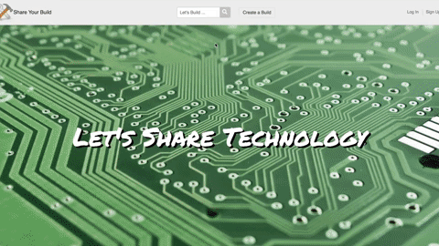
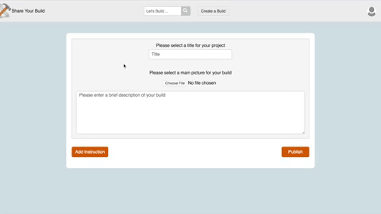

Welcome to the ShareYourBuild README!

A single page web application built with React and Ruby on Rails. Where DIY enthusiasts share their ideas.

[Live Link](https://share-your-build.herokuapp.com/?#/)

**Technology used for Share Your Build** (Languages, Frameworks, Libraries, Etc.)

- Ruby on Rails
- PostgreSQL
- React
- Redux
- react slick
- Gems
  - aws-sdk-s3
  - Jbuilder
  - BCrypt
  - pg_search

**Features**

- Authentication

  

- A user can sign in or sign up from any page via the links on the header.
- Protected Authentication routes for creating and editing projects.
- The login credentials are verified on the backend and returns any relevant data to the user.

- Project Creation
  

  - Used RESTful API design to perform full CRUD on projects, instructions, and comments.
  - The project form aggregates data from each instruction component in order to limit Ajax requests.
  - Created and integrated a rich text editor so users can format their instructions.
  - Image storage with AWS S3, so users can upload multiply images per instruction.

- Search Bar
  

  - Quickly access projects on the backend and display

**Future Features**

- Enable a search feature with autocomplete for keywords or users
- Add the ability to like projects
